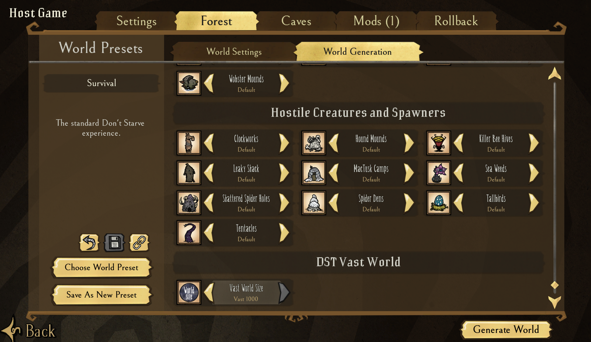

# DST Vast World

`DST Vast World` is a Don't Starve Together server/worldgen mod focused on pushing world generation beyond the vanilla map-size presets.

Imagine a world so vast that continents feel like real continents and oceans feel like real oceans. Traveling to another region becomes a genuine expedition — you plan ahead, pack supplies, and build waystations along the journey.

## Project status

Active development. The worldgen size shim is functional.

| Preset                  | Tiles  | Status                 |
| ----------------------- | ------ | ---------------------- |
| Vanilla Small           | 50     | -                      |
| Vanilla Medium          | 400    | -                      |
| Vanilla Large (Default) | 425    | -                      |
| Vanilla Huge            | 450    | -                      |
| Vast 500                | 500    | supported              |
| Vast 750                | 750    | supported              |
| Vast 1000               | 1000   | supported              |
| Beyond 1024             | > 1024 | planned — engine limit |

## Install

### Install with Steam Workshop

Not yet released.

### Manual install

**1. Clone this repo**

```sh
git clone https://github.com/user/dst-vast-world.git
```

**2. Locate your DST installation**

The default Steam paths are:

| Platform | Path                                                                  |
| -------- | --------------------------------------------------------------------- |
| Linux    | `$HOME/.steam/root/steamapps/common/Don't Starve Together`            |
| Windows  | `C:\Program Files (x86)\Steam\steamapps\common\Don't Starve Together` |

If you used a custom install location, adjust accordingly.

**3a. Install with the script (Recommended, Linux)**

```sh
cp .env.example .env   # edit DST_PATH in .env if not using the default
./dev-scripts/install-mod.sh
```

**3b. Or install manually (any platform)**

Copy the `dst-vast-world` folder into the `mods/` directory inside your DST installation.

## Usage

1. When creating a world, enable `DST Vast World` under **Server Mods**.
2. Navigate to **Forest → World Generation**, scroll to the bottom — you'll find a new **Vast World Size** dropdown added by this mod (see screenshot below). Select your desired size.
3. Click **Generate World**.



## Documentation

| Document                                     | Content                                               |
| -------------------------------------------- | ----------------------------------------------------- |
| [docs/dev-guide.md](docs/dev-guide.md)       | Setup, testing, modding practices                     |
| [docs/architecture.md](docs/architecture.md) | Vanilla hooks analysis, current approach, shim design |
